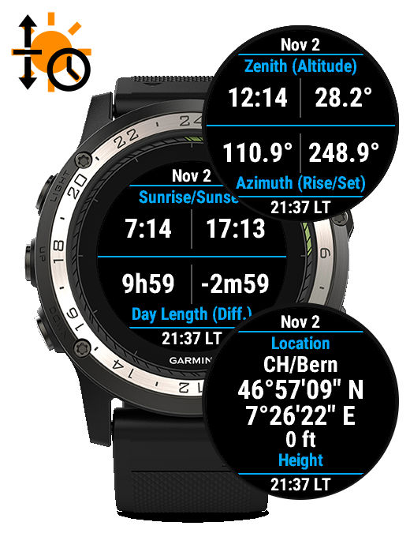

SunAlmanac (Garmin ConnectIQ) Widget
====================================
Sunrise/Sunset data for Garmin ConnectIQ devices

   

SunAlmanac is a Garmin ConnectIQ Widget that displays sunrise/sunset data:
 - Sunrise/Sunset time
 - Day Length (and Difference)
 - Civil Dawn/Dusk time
 - Nautical Dawn/Dusk time
 - Astronomical Dawn/Dusk time
 - Ecliptic Longitude and Declination
 - Noon time and Elevation angle
 - Sunrise/Sunset Azimuth angles
 - Current Azimuth and Elevation angles

At the current GPS location or a user-specified location.
At the current date or a user-specified date.

Build, Installation and Usage
-----------------------------

Please refer to the INSTALL and USAGE files.

